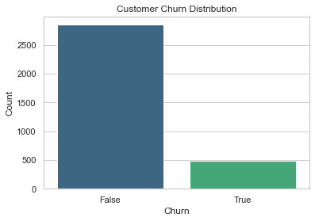
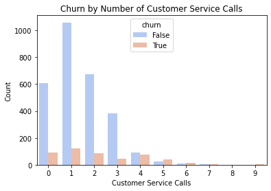
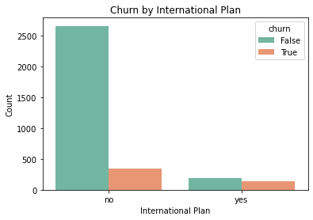
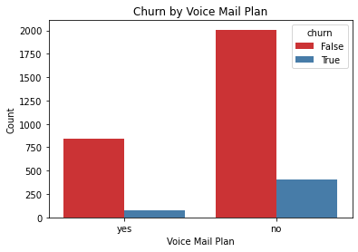
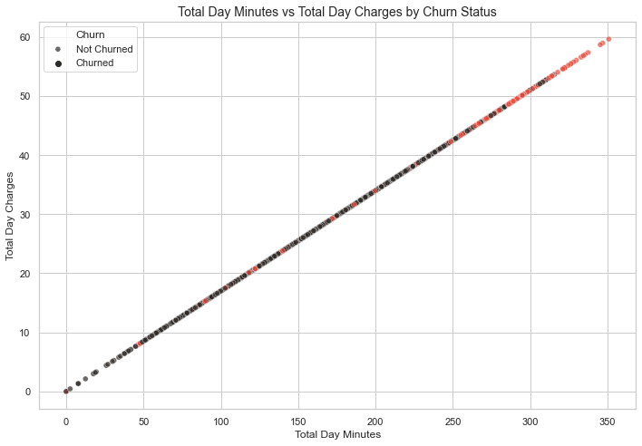
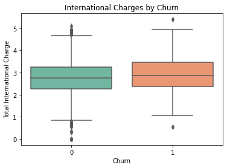
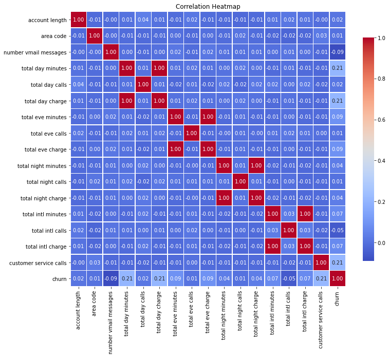

# PROJECT TITLE :  SYRIAL TEL CUSTOMER CHURN PREDICTION

# PROJECT OVERVIEW
This project builds a machine learning model to predict customer churn for SyriaTel, a telecommunications provider. Churn prediction is essential in the telecom industry, where losing customers leads to significant revenue loss. By identifying customers likely to leave, SyriaTel can take proactive steps to retain them.

The solution is framed as a binary classification problem:
Will the customer churn? → Yes (1) or No (0)

# BUSINESS UNDERSTANDING 
In the telecom industry, customer retention is a critical business priority due to the high cost of acquiring new customers compared to maintaining existing ones. For SyriaTel, a leading telecommunications provider, customer churn—the percentage of users who stop using the service—is a significant challenge impacting revenue and long-term growth.

Understanding why customers churn and being able to predict who is likely to leave offers a major strategic advantage. If SyriaTel can identify at-risk customers early, it can take proactive measures such as:

Offering targeted promotions or personalized plans,

Improving service quality based on user feedback,

Enhancing customer support for high-risk segments.

**Stakeholder Audience**

Business stakeholders with the aim of marketing, customer success, operation: need insights on at-risk customers and actionable strategies to reduce churn.

**Technical stakeholders**

Data analysts, ML engineers: interested in modeling approach, evaluation metrics, and deployment considerations.

# PROBLEM STATEMENT
In today’s highly competitive telecommunications sector, customers have a wide array of service providers to choose from, making customer loyalty increasingly fragile. A single poor experience can shape a customer’s perception of an entire brand, highlighting the critical importance of customer satisfaction in retaining users. With communication services deeply embedded in our daily routines, minimizing customer churn has become a strategic priority for telecom companies.

Customer churn, defined as the rate at which subscribers discontinue or fail to renew their services, poses a direct threat to revenue. Since retaining existing customers is significantly more cost-effective than acquiring new ones, understanding the factors driving churn is essential. Through detailed churn analysis, businesses can uncover behavioral patterns, segment at-risk users, improve service offerings, and design more effective customer retention strategies.

By leveraging predictive modeling and generating actionable insights, telecom firms can proactively address churn risks and strengthen customer relationships—ensuring long-term business sustainability and growth.

# DATA UNDERSTANDING
**1. Data Collection and Preparation**
Dataset: Used SyriaTel's dataset containing 3,333 customer records with 21 features including demographics, service usage, call durations, and plan subscriptions.

**Data Cleaning:**

Removed irrelevant columns like phone number.

Converted categorical variables (e.g., international plan, voice mail plan) into numeric values using Label Encoding.

Transformed the target variable churn from boolean to integer format.

**Data Integrity:**

Checked for null values (none found).

Ensured data types were correctly assigned to numeric and categorical features.

**2.Exploratory Data Analysis (EDA)**
**Univariate Analysis:**

Plotted bar charts for categorical features like international plan, voice mail plan, and churn.

Used histograms to show distributions of numerical variables like total day minutes, customer service calls.

**Bivariate Analysis:**

Boxplots: e.g., Total International Charges by Churn.

Countplots: e.g., Churn by International Plan and Churn by Voice Mail Plan.

**Multivariate Analysis:**

Correlation heatmap for all numerical features to observe relationships and redundancy.

Analyzed churn across multiple variables using grouped bar plots and color-coded feature distributions.

**3. Predictive Modeling**

Models Used:

Logistic Regression: Achieved 85.8% accuracy but had low recall for churned customers.

Decision Tree Classifier: Achieved 92.9% accuracy with better balance between precision and recall.

Model Evaluation Metrics:
	                                                
Accuracy

Precision

Recall

F1 Score

ROC AUC Score	
	

# DATA VISUALIZATIONS

**1. Customer Churn Distribution**

The number of customers who did not churn is significantly higher than the number of customers who did churn. 

Business Implication: Though relatively low, this segment represents potential revenue loss if not addressed proactively.

**2. Churn by Number of Customer Service Calls**

Insight: Customers with more customer service calls were significantly more likely to churn.

Business Implication: High support interactions may signal unresolved issues or dissatisfaction. These customers should be flagged for escalation and follow-up.

**3. Churn by International Plan**

Insight: Customers with an international plan showed a higher likelihood of churn compared to those without.

Business Implication: Evaluate pricing or service quality for international plans; dissatisfaction may be driving customers away.

**4. Churn by Voice Mail Plan**

Insight: Customers with a voice mail plan were less likely to churn.

Business Implication: The voice mail plan might contribute to perceived value or satisfaction; upselling this feature could help retention.

**5. Total Day Minutes vs Total Day Charges by Churn Status**

Insight: Churned customers often had higher day-time minutes and charges, possibly indicating dissatisfaction with cost-effectiveness.

Business Implication: Consider personalized billing options or rewards for heavy users to retain them.

**6. International Charges by Churn**

Insight: Churned customers had a higher average of international charges.

Business Implication: Customers may be leaving due to cost concerns related to international calling. Introducing flexible pricing or bundling options could mitigate churn.

**7. Correlation Heatmap**

Insight: Differences in usage behavior (e.g., total day minutes, intl charge, customer service calls) between churned and non-churned customers were clearly visible.

Business Implication: These behavioral indicators are useful for segmenting high-risk customers for targeted retention strategies.

# MODELING
Several classification models were trained to predict churn:

Logistic Regression

Decision Tree Classifier

# EVALUATION
Two models were evaluated to predict customer churn: Logistic Regression and a Decision Tree Classifier. While both achieved strong overall performance, the Decision Tree outperformed Logistic Regression in key areas.

Decision Tree achieved the highest Accuracy (0.91), Precision (0.69), Recall (0.68), and F1 Score (0.68), making it the best model overall.

Logistic Regression, while slightly ahead in ROC AUC (0.81 vs 0.812), had a much lower Recall (0.26), meaning it missed many actual churners.

In churn prediction, Recall is especially important as it measures how well the model identifies customers likely to leave.

The Decision Tree model was therefore selected as the final model due to its balanced and strong performance across metrics, especially in identifying customers at risk of churning.

# FINDINGS

A significant number of churned customers share similar behavioral patterns—such as shorter tenures, higher monthly charges, or lack of contract commitments.

The Decision Tree model was best at identifying customers likely to churn, achieving:

Accuracy: 91%

Recall: 68% — meaning it successfully identified most churners

F1 Score: 0.68 — showing a good balance between precision and recall

Logistic Regression, while slightly better in ROC AUC, missed more actual churners (lower recall).

# RECOMMENDATIONS

Focus retention strategies on customers with:

Month-to-month contracts

High service charges

Monitor high-risk segments identified by the model and intervene early (e.g., with discounts, loyalty programs, or personalized offers).

Regularly retrain and evaluate the model to adapt to evolving customer behavior and improve performance.

Consider enhancing the dataset with customer engagement data (e.g., support calls, usage patterns) to improve future predictions.
